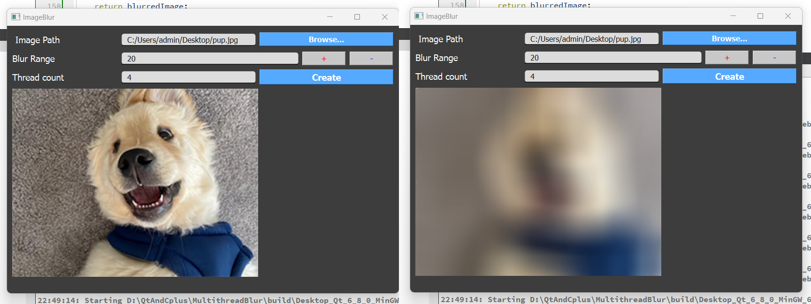

imageBlur is a lightweight image processing tool built in C++. 

It allows users to apply blur effects to images by inputting a desired blur intensity. 

Leveraging C++ multithreading, the tool efficiently handles images with large pixel dimensions, delivering results quickly. Additional features and processing options are continually being developed and refined to enhance functionality.
